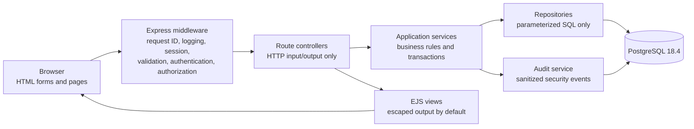
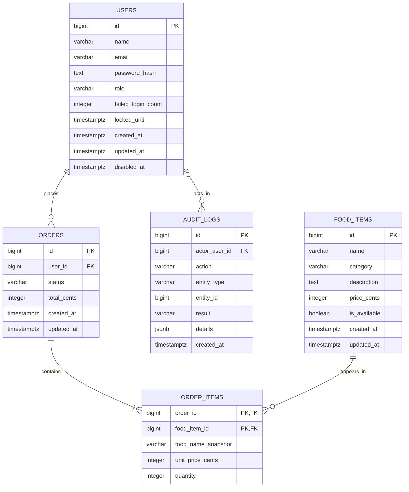

# Application Design

- Project: Secure Online Food Ordering System
- Design date: July 30, 2026
- Status: Approved Day 2 design baseline
- Technology baseline: [`technology-stack.md`](technology-stack.md)
- Requirements sources: `Completed Proposal_1.docx`, `flow.md`, and `ProjectPlan.md`

## 1. Scope and architecture

The application is a server-rendered food-ordering website with separate customer and administrator workflows. The secure implementation remains on the primary development path. Any intentionally vulnerable implementation must be isolated, use fictional data, display a local-only warning, and use a separate database/configuration.



### Layer responsibilities

- **Configuration:** Load and validate environment variables once at startup. Never expose secrets to templates, browser responses, or logs.
- **Middleware:** Assign request IDs; parse requests; enforce size limits; load sessions; apply authentication, ownership, and administrator authorization; handle not-found and unexpected errors.
- **Controllers:** Translate HTTP input into service calls and choose redirects, status codes, JSON, or EJS views. Controllers do not contain SQL.
- **Services:** Enforce trusted values, pricing, ownership, role rules, order transactions, status transitions, and audit decisions.
- **Repositories:** Execute parameterized PostgreSQL queries and return domain records. Dynamic SQL made from user input is prohibited in the secure implementation.
- **Views:** Render semantic HTML through EJS escaped interpolation. Unescaped EJS output is prohibited unless the value is static or explicitly sanitized and reviewed.
- **Audit:** Record important authentication, order, administrator, and authorization events without passwords, session IDs, secrets, or raw security payloads.

### Planned source boundaries

```text
src/
  app.js
  server.js
  config/
  middleware/
  routes/
  controllers/
  services/
  repositories/
  db/
  security/
  views/
public/
db/
  migrations/
  seeds/
tests/
  unit/
  integration/
  security/
docs/
evidence/
```

The final directory names may be adjusted during scaffolding, but the layer boundaries and dependency direction must remain the same.

## 2. Page map

| Page | Path | Access | Main purpose | Primary data |
| --- | --- | --- | --- | --- |
| Menu | `/` | Public | Display available fictional foods by category | `food_items` |
| Registration | `/register` | Anonymous only | Create a customer account | `users` |
| Login | `/login` | Anonymous only | Start an authenticated session | `users`, session store |
| Search results | `/search` | Public | Search available foods by name or category | `food_items` |
| Cart/order draft | `/cart` | Authenticated customer/admin | Review session-backed selections and trusted server prices | Session, `food_items` |
| Order confirmation | `/orders/:orderId` | Order owner or admin | Show the completed order and line items | `orders`, `order_items` |
| Order history | `/orders` | Authenticated user | Show only the signed-in user's orders | `orders`, `order_items` |
| Admin food management | `/admin/food-items` | Administrator | List, create, edit, and disable foods | `food_items`, `audit_logs` |
| Admin order list | `/admin/orders` | Administrator | Review all customer orders and details | `orders`, `order_items`, `users` |
| Error page | Status-specific | Appropriate to request | Display safe 400, 403, 404, and 500 responses | Request ID only |

## 3. Route and HTTP contract

### Public and authentication routes

| Method | Route | Access | Input | Success | Controlled failure |
| --- | --- | --- | --- | --- | --- |
| `GET` | `/health` | Public | None | `200` JSON containing service status only | `503` JSON without configuration details when dependencies are unavailable |
| `GET` | `/` | Public | Optional category filter | `200` menu page with available foods | `200` empty state when no foods are available |
| `GET` | `/register` | Anonymous only | None | `200` registration form | Authenticated users redirect to `/` |
| `POST` | `/register` | Anonymous only | Name, email, password, password confirmation | `303` redirect to `/login` after account creation | `422` form with generic validation errors; duplicate email does not expose database details |
| `GET` | `/login` | Anonymous only | Optional safe return path | `200` login form | Authenticated users redirect to `/` |
| `POST` | `/login` | Anonymous only | Email and password | Regenerate session, then `303` redirect to safe return path or `/` | `401` generic login error; lockout/delay policy applies without revealing account existence |
| `POST` | `/logout` | Authenticated | No trusted client data | Destroy server session, clear cookie, and `303` redirect to `/login` | Safe idempotent redirect when the session is already absent |
| `GET` | `/search` | Public | `q`, optional `category` | `200` encoded search-results page | `422` for invalid length/type; `200` no-result state for valid empty results |

### Cart and customer order routes

The cart is stored in the server-side session until checkout. The server loads current food records and prices; the client cannot set price, role, owner, total, or order status.

| Method | Route | Access | Input | Success | Controlled failure |
| --- | --- | --- | --- | --- | --- |
| `GET` | `/cart` | Authenticated | None | `200` cart page with server-calculated totals | `200` empty-cart state |
| `POST` | `/cart/items` | Authenticated | `foodItemId`, integer `quantity` | `303` redirect to `/cart` | `404` unavailable food; `422` invalid ID or quantity |
| `POST` | `/cart/items/:foodItemId/update` | Authenticated | Integer `quantity` | `303` redirect to `/cart` | `404` item absent; `422` invalid quantity |
| `POST` | `/cart/items/:foodItemId/remove` | Authenticated | Route ID only | `303` redirect to `/cart` | Safe idempotent redirect when already absent |
| `POST` | `/orders` | Authenticated | No trusted price/owner fields | Transaction creates order and items, clears cart, and `303` redirects to `/orders/:orderId` | `409` for unavailable items; rollback and safe `500` for database failure |
| `GET` | `/orders` | Authenticated | Optional bounded pagination | `200` signed-in user's order history | `200` empty state |
| `GET` | `/orders/:orderId` | Owner or administrator | Positive integer order ID | `200` order detail/confirmation | `404` for missing or non-owned customer order to avoid exposing existence |

### Administrator routes

All administrator routes require both an authenticated session and a server-side `admin` role check. Hiding navigation is not an authorization control.

| Method | Route | Access | Input | Success | Controlled failure |
| --- | --- | --- | --- | --- | --- |
| `GET` | `/admin/food-items` | Admin | Optional bounded pagination/filter | `200` management list | `403` for authenticated non-admin |
| `GET` | `/admin/food-items/new` | Admin | None | `200` create form | `403` for authenticated non-admin |
| `POST` | `/admin/food-items` | Admin | Name, category, description, price, availability | Create and audit, then `303` redirect | `422` controlled validation errors |
| `GET` | `/admin/food-items/:foodItemId/edit` | Admin | Positive integer ID | `200` edit form | `404` missing item; `403` non-admin |
| `POST` | `/admin/food-items/:foodItemId` | Admin | Editable food fields | Update and audit, then `303` redirect | `404` missing item; `422` invalid data |
| `POST` | `/admin/food-items/:foodItemId/disable` | Admin | Positive integer ID | Disable and audit, then `303` redirect | `404` missing item; safe handling when already disabled |
| `GET` | `/admin/orders` | Admin | Status filter and bounded pagination | `200` customer-order list | `403` non-admin |
| `GET` | `/admin/orders/:orderId` | Admin | Positive integer ID | `200` customer-order details | `404` missing order; `403` non-admin |
| `POST` | `/admin/orders/:orderId/status` | Admin | Allowed next status | Update and audit, then `303` redirect | `404` missing order; `409` invalid transition; `422` invalid status |

### Common response rules

- Use `303 See Other` after successful form submissions to prevent duplicate writes on refresh.
- Return generic browser-facing errors; log sanitized diagnostic context with a request ID.
- Validate all route parameters, query strings, and form fields on the server.
- Reject unexpected fields on data-changing requests.
- Apply request-body, string-length, numeric-range, and pagination limits.
- Never accept trusted values such as price, total, role, owner, password hash, audit actor, or order status from an unauthorized client.

## 4. Entity relationship design



The PostgreSQL-backed session library also owns an infrastructure session table. That table is not a business-domain entity and is intentionally outside the five-entity proposal ERD.

## 5. Keys, constraints, and indexes

### `users`

- Primary key: `id`.
- Required fields: trimmed `name`, normalized `email`, `password_hash`, `role`, timestamps.
- Unique constraint/index: case-insensitive unique index on `lower(email)`.
- Checks: allowed roles are `customer` and `admin`; failed-login count is non-negative; email/name lengths are bounded.
- Password material: only the versioned scrypt hash string is stored; plaintext passwords and reset secrets are never stored or audited.
- Delete policy: disable accounts rather than deleting users with orders.

### `food_items`

- Primary key: `id`.
- Required fields: name, category, description, `price_cents`, `is_available`, timestamps.
- Checks: bounded text lengths; `price_cents >= 0`.
- Indexes: `(is_available, category, name)` for menu browsing and category filtering; `lower(name)` and `lower(category)` for normalized lookup.
- Delete policy: disable by setting `is_available = false`; preserve records referenced by historical orders.

### `orders`

- Primary key: `id`.
- Foreign key: `user_id -> users.id` with `ON DELETE RESTRICT`.
- Checks: allowed statuses are `confirmed`, `preparing`, `completed`, and `cancelled`; `total_cents >= 0`.
- Indexes: `(user_id, created_at DESC)` for customer history; `(status, created_at DESC)` for administrator review.
- Integrity: created with all `order_items` in one transaction; total is computed from stored line prices, never from client input.

### `order_items`

- Composite primary key: `(order_id, food_item_id)`.
- Foreign keys: `order_id -> orders.id ON DELETE CASCADE`; `food_item_id -> food_items.id ON DELETE RESTRICT`.
- Required snapshot fields: food name and unit price at purchase time.
- Checks: `quantity BETWEEN 1 AND 99`; `unit_price_cents >= 0`.
- Index: `food_item_id` for impact/history lookup.

### `audit_logs`

- Primary key: `id`.
- Nullable foreign key: `actor_user_id -> users.id ON DELETE SET NULL` to support anonymous failures and preserve history.
- Required fields: action, entity type, result, sanitized details object, timestamp.
- Checks: result is `success`, `failure`, or `denied`; action/entity strings and JSON size are bounded.
- Indexes: `(actor_user_id, created_at DESC)`, `(action, created_at DESC)`, and `(entity_type, entity_id, created_at DESC)`.
- Prohibited content: passwords, hashes, cookies, session IDs, secrets, authorization headers, raw SQL payloads, and unnecessary personal data.

## 6. Order transaction and status rules

1. Validate the session cart and load all referenced foods in a transaction.
2. Lock or consistently read selected food rows.
3. Reject missing or unavailable foods and invalid quantities.
4. Compute line prices and total on the server.
5. Insert one `orders` row and all `order_items` rows.
6. Insert a sanitized order-created audit event.
7. Commit the transaction, then clear the session cart.
8. Roll back every database write if any step fails.

Allowed status transitions:

```text
confirmed -> preparing -> completed
confirmed -> cancelled
preparing -> cancelled
```

Completed or cancelled orders are terminal.

## 7. Vulnerability, control, and test mapping

| ID | Vulnerable demonstration | Secure control | Matching secure test |
| --- | --- | --- | --- |
| `SEC-SQL-01` | Login or search concatenates fictional input into SQL | `pg` parameter binding, allowlisted query structure, input length/type validation, least-privilege application role | Run the same SQL-injection strings against both environments; secure login/search must not alter query structure, authenticate, expose extra rows, or modify data |
| `SEC-XSS-01` | Reflected search text or stored fictional food description is rendered without encoding | EJS escaped interpolation, contextual encoding, validation, and sanitization only when formatted content is explicitly allowed | Submit reflected and stored script payloads; secure page must display harmless text and execute no script |
| `SEC-PASS-01` | Vulnerable demo permits weak/plain passwords or unsafe login feedback | Asynchronous scrypt with random salt, strong password rules, generic errors, failed-login counter and bounded lockout/delay | Verify stored value is not plaintext, weak passwords fail, correct passwords work, enumeration messages match, and repeated failures trigger protection |
| `SEC-SESS-01` | Session ID is reused after login/logout or cookies lack protections | Regenerate after login; server-side PostgreSQL store; `HttpOnly`, `SameSite`, bounded expiry, `Secure` under HTTPS; idle expiry; destroy/clear on logout | Compare pre/post-login IDs; verify expired/logged-out IDs cannot access protected routes; inspect cookie attributes |
| `SEC-RBAC-01` | Normal user directly calls administrator routes | Authentication and administrator middleware on every admin route; role loaded from server-side user/session state | Anonymous requests are rejected; customer requests receive `403`; admin requests succeed |
| `SEC-OWNER-01` | One customer changes an order ID to view another customer's order | Ownership-scoped repository query and service authorization; admin override only through admin route | Customer A cannot view Customer B's order and receives non-enumerating `404`; admin can review through `/admin/orders/:id` |
| `SEC-INPUT-01` | Client supplies price, total, role, owner, status, invalid IDs, or extreme quantities | Reject unexpected fields; validate types/ranges; load trusted values from database/session; enforce status transitions | Tampered trusted fields are ignored/rejected; invalid IDs and quantities fail; stored totals and ownership remain server-derived |
| `SEC-DB-01` | Vulnerable environment uses a database owner/superuser account | Separate migration and application roles; application role receives only required CRUD/sequence permissions | Application role can perform normal workflows but cannot create/drop schema objects, alter roles, or access unrelated databases |
| `SEC-AUDIT-01` | Sensitive actions occur without a reliable trail, or logs capture secrets | Structured audit events for login, logout, order, admin changes, and denials; sanitized bounded details | Required events exist with correct actor/result; scans confirm no password, cookie, session ID, secret, or raw attack payload |
| `SEC-RECOVERY-01` | Data is deleted/corrupted with no tested recovery | Cross-platform `pg_dump`/`pg_restore` workflow, separate restore target, integrity comparison | Back up populated fictional data, restore separately, and compare users, foods, orders, items, and audit counts/content |
| `SEC-TLS-01` | Sensitive traffic or session cookie is sent over an insecure public connection | Local HTTP only for development; HTTPS required for any non-local environment; `Secure` session cookie under HTTPS | Production-mode configuration rejects unsafe deployment assumptions and sets the `Secure` cookie attribute |

The intentionally vulnerable code and database must never be deployed publicly or share credentials/data with the secure implementation.

## 8. Requirements coverage verification

| Requirement | Design coverage | Status |
| --- | --- | --- |
| Register, log in, and log out | Registration/login pages and routes; server-side session lifecycle | Covered |
| Browse foods | Public `/` menu backed by `food_items` | Covered |
| Search by name or category | `/search` contract and food indexes | Covered |
| Add items and place an order | Session cart plus transactional `POST /orders` | Covered |
| Review own orders | `/orders` and ownership-protected `/orders/:orderId` | Covered |
| Admin manages food | Create, edit, and disable routes under `/admin/food-items` | Covered |
| Admin views customer orders | `/admin/orders` list and detail routes | Covered |
| Normal user cannot use admin functions | Server-side authentication and RBAC middleware | Covered |
| Users cannot access another user's orders | Ownership-scoped route/repository rule | Covered |
| Database-driven design | Five proposal entities with keys, constraints, and indexes | Covered |
| SQL injection comparison | `SEC-SQL-01` vulnerable/secure matched test | Covered |
| XSS comparison | `SEC-XSS-01` reflected and stored matched tests | Covered |
| Password and login protection | `SEC-PASS-01` | Covered |
| Secure sessions | `SEC-SESS-01` | Covered |
| Least-privilege database access | `SEC-DB-01` | Covered |
| Audit logging | `audit_logs` design and `SEC-AUDIT-01` | Covered |
| Backup and recovery | `SEC-RECOVERY-01` | Covered |
| Cryptographic protection | scrypt password hashing and HTTPS deployment rule | Covered |
| Fictional data and isolated vulnerable demo | Scope rule and separate configuration/database | Covered |
| Matching evidence and tests | Stable security IDs link scenarios, controls, tests, and later evidence | Covered |

### Verification result

All page types, business entities, functional workflows, security topics, and evidence comparisons named in the proposal and project flow have an explicit page/route, entity, control, or test mapping. No required proposal feature is left without a design owner.
