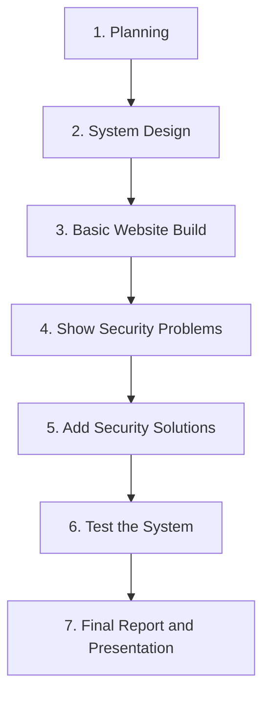

# Secure Online Food Ordering System: Project Flow

## Project Goal

Build a small food ordering website. The project will show an unsafe version first, then a secure version. This helps students understand common web security problems and their solutions.

## 1. Planning

- Choose the project topic and main website features.
- Divide tasks among group members.
- Plan the website pages, database, and security work.

## 2. System Design

- Design pages for registration, login, food menu, search, orders, and admin work.
- Create database tables for users, food items, orders, order items, and audit logs.
- Plan the unsafe version and the secure version of the website.

## 3. Basic Website Build

- Let users create accounts, log in, and log out.
- Let users view food, search for food, add food to an order, and place orders.
- Let admins manage food items and view customer orders.

## 4. Security Problems and 5. Matching Solutions

| Security problem | Matching solution |
| --- | --- |
| **SQL Injection:** Unsafe login or search input may change database queries. | Use prepared statements and check user input. |
| **XSS:** Unsafe user text may run harmful scripts on the website. | Clean user input and safely display text on the page. |
| **Weak Passwords:** Plain or weak passwords may allow unwanted access. | Hash passwords and require strong passwords. |
| **Unsafe Sessions:** A stolen session ID may let someone use another user's account. | Use secure cookies, create a new session ID after login, and end sessions after logout or timeout. |
| **Weak Admin Access:** Normal users may enter admin pages. | Use role-based access control. Only admins can use admin pages. |
| **Too Much Database Access:** One database account may have too many permissions. | Use least-privilege database accounts. Each account gets only the access it needs. |
| **Data Loss:** Important data may be deleted, changed, or lost. | Save audit logs, make regular backups, and prepare a recovery plan. |

## 6. Testing

- Test the unsafe version in a safe classroom environment.
- Test whether the secure version stops the same security problems.
- Check login, search, ordering, admin pages, and database access.
- Take screenshots of the test results.

## 7. Final Report and Presentation

- Compare the unsafe version with the secure version.
- Explain each security problem and its matching solution.
- Show screenshots, database design, and test results.
- Submit the working prototype, report, and presentation.

## Final Deliverables

- A working food ordering website.
- An unsafe version and a secure version for comparison.
- Database design and security explanation.
- Test screenshots and explanations.
- Final report or presentation.
