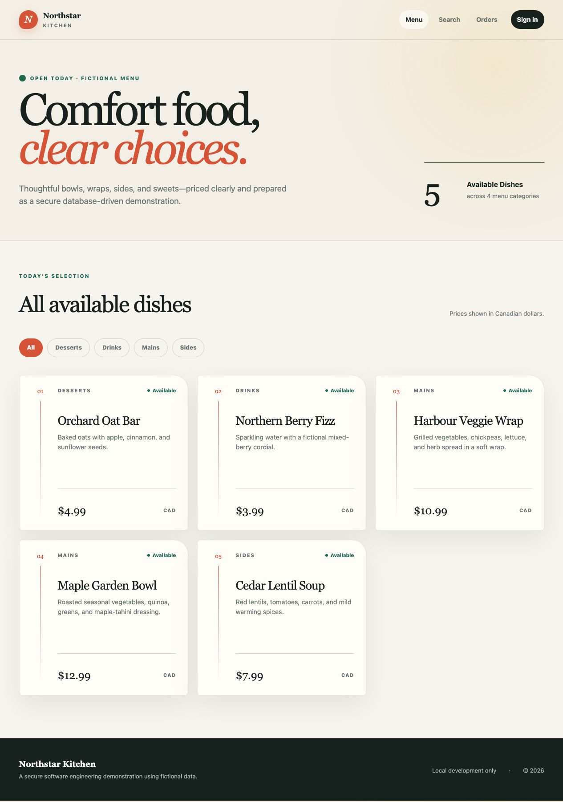
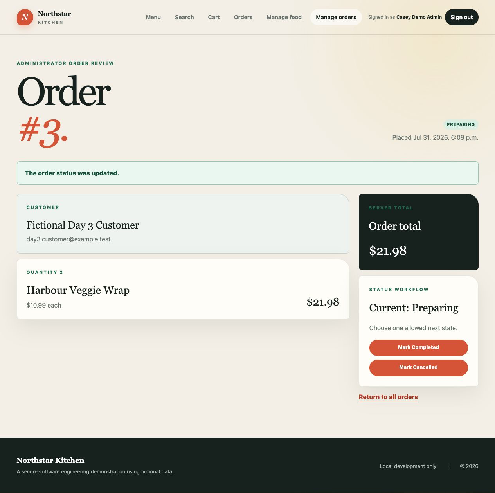
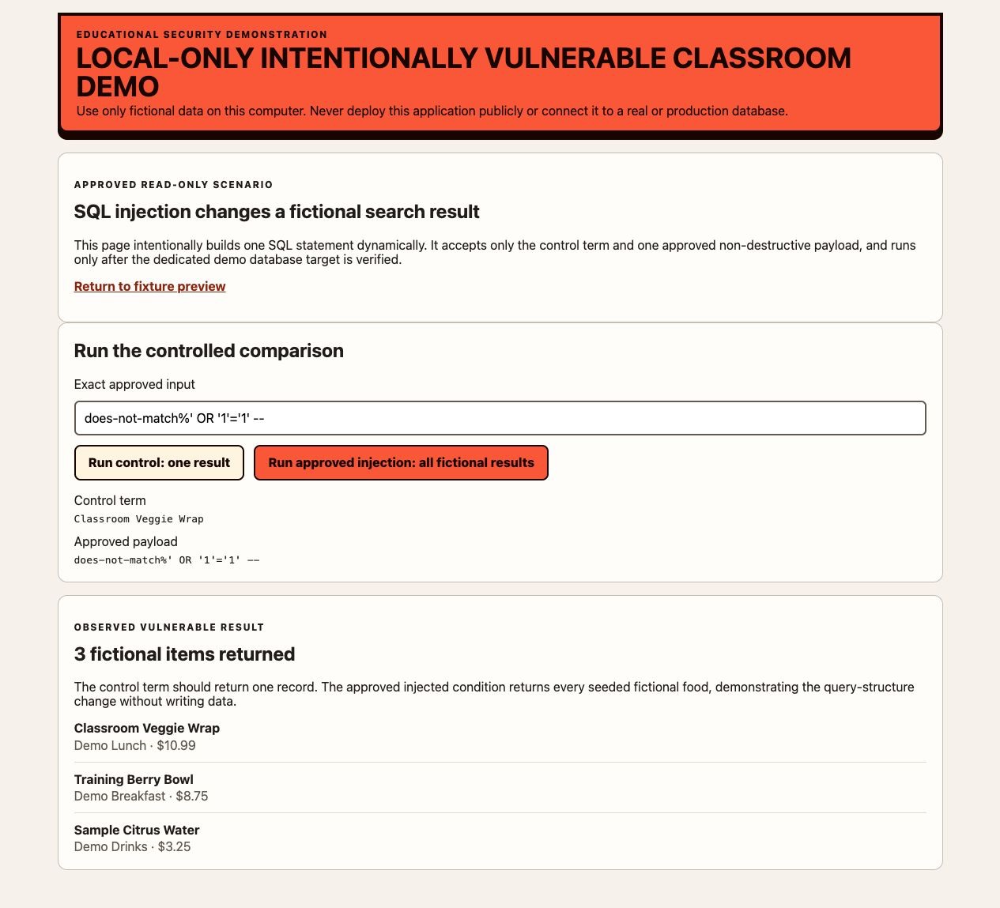
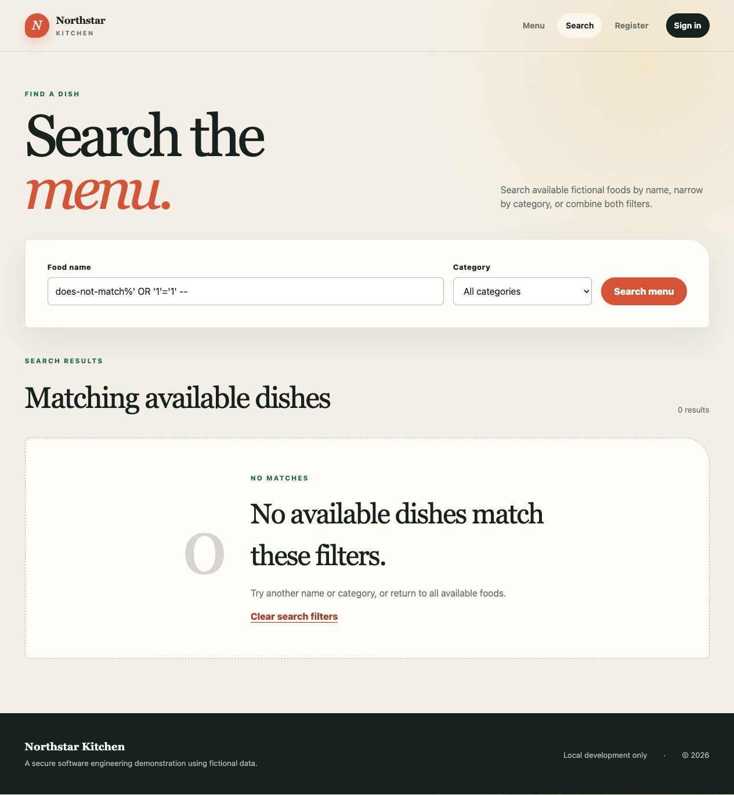

# Secure Online Food Ordering System — Installation & Operational Instructions

本指南提供 **Secure Online Food Ordering System** 从 GitHub 仓库下载、依赖安装、数据库初始化、安全对比演练到最终项目部署与灾难恢复的全流程操作说明，并结合 `evidence/` 目录下的所有 14 张截图证据进行验证说明。

> [!IMPORTANT]
> **双架构设计与复现说明（架构澄清）：**
> 1. **双环境并行存在**：从 GitHub 克隆的项目**已同时包含主安全应用与独立的脆弱演示环境**，无需回退或还原历史 Git Commit。
>    - **主安全应用 (Secure App)**：运行于 `http://127.0.0.1:3000` (`npm start`)。
>    - **隔离脆弱环境 (Isolated Vulnerable Demo)**：内置于 `demo/vulnerable/`，运行于 `http://127.0.0.1:3001` (`npm run demo:vulnerable:start`)。
> 2. **实时攻防对比复现**：对于 SQL 注入 (步骤 3) 与 XSS (步骤 4)，用户可同时开启 3001 端口（脆弱版）和 3000 端口（安全版），使用相同 Payload 进行同屏对比演练。
> 3. **证据截图的定位**：`evidence/` 中的 14 张截图既是开发阶段留下的**标准评审凭证**，也是用户在本地复现操作时的**预期基准对照**。

---

## 步骤 0：GitHub 仓库克隆与环境安装 (GitHub Clone & Setup)

### 0.1 克隆仓库与项目初始化

在终端（macOS Terminal）或原生 Windows PowerShell 中执行以下命令克隆仓库并安装依赖：

```bash
# 克隆 GitHub 仓库
git clone https://github.com/ZhehaoShen/secure-online-food-ordering-system.git
cd secure-online-food-ordering-system

# 配置环境变量文件
# macOS / Linux:
cp .env.example .env

# Windows PowerShell:
# Copy-Item .env.example .env

# 安装项目依赖 (忽略脚本自动执行以确保安全)
npm ci --ignore-scripts
```

### 0.2 数据库与角色初始化

确保本地 PostgreSQL 数据库服务已启动，然后运行数据库初始化命令：

```bash
# 1. 创建数据库角色 (最小权限角色划分)
npm run db:roles

# 2. 执行数据库迁移 (建表与索引)
npm run db:migrate

# 3. 导入演示假数据 (Seed Data)
npm run db:seed
```

### 验证证据：Windows 环境全新克隆与运行

- **证据图片**：
  
- **验证说明**：证明项目在原生 Windows PowerShell 环境下（无需 WSL 或 Linux 模拟层）可通过 GitHub 纯净克隆并成功完成依赖安装与服务启动。

---

## 步骤 1：基础数据库与菜单建置 (Day 2 — Database & Menu Foundation)

### 1.1 操作说明

启动主安全应用并验证健康检查接口：

```bash
# 启动安全应用 (默认运行于 http://127.0.0.1:3000)
npm start

# 在另一个终端窗口运行健康检查
npm run healthcheck
```

### 验证证据：数据库驱动菜单与健康检查

- **证据图片**：
  
- **验证说明**：
  - 健康检查接口响应正常（`HTTP 200 OK`）。
  - 首页成功渲染由 PostgreSQL 数据库驱动的 5 个上架美食，包括分类、描述、CAD 价格及供货状态，未上架商品被安全过滤。

---

## 步骤 2：顾客与管理员核心业务流程 (Day 3 — Customer & Admin Workflows)

### 2.1 操作说明

1. 访问 `http://127.0.0.1:3000/register` 注册顾客账号并登录。
2. 浏览菜单并搜索“Harbour Veggie Wrap”，添加 2 份到购物车并提交订单。
3. 在订单确认页与历史订单页查看订单 #3 详情。
4. 退出顾客账号，使用管理员账号登录，进入后台管理界面更新订单 #3 状态为 `Preparing`。

### 验证证据：完整订单交易与管理员状态流转

- **证据图片**：
  
- **验证说明**：
  - 顾客订单生成总价 `$21.98`，数据持久化存储于 PostgreSQL 数据库。
  - 管理员后台成功调取订单快照，并将订单状态安全流转至“Preparing”，系统显示明确操作成功提示，控制台无报错。

---

## 步骤 3：SQL 注入攻防对比演练 (Day 4 & Day 5 — SQL Injection Comparison)

### 3.1 操作说明

1. **启动隔离的脆弱演示环境**（仅限本地 loopback 运行）：
   ```bash
   npm run demo:vulnerable:setup
   npm run demo:vulnerable:start
   ```
   访问 `http://127.0.0.1:3001`。

2. **搜索 SQL 注入测试**：
   在脆弱版本与安全版本的搜索框中输入相同的恶意 Payload：
   ```sql
   does-not-match%' OR '1'='1' -- 
   ```

3. **登录 SQL 注入测试**：
   在脆弱版本与安全版本的登录框中输入相同的绕过 Payload：
   ```sql
   ' OR '1'='1
   ```

### 验证证据 3.1：搜索 SQL 注入对比

| 脆弱版本 (Insecure Search) | 安全版本 (Secure Search) |
| --- | --- |
|  |  |
| **现象**：拼接 SQL 逻辑被改变，返回了所有 3 个假数据菜品。 | **现象**：参数化查询将输入视为普通字面量，返回 `0 matches`，无异常泄露。 |

### 验证证据 3.2：登录 SQL 注入对比

| 脆弱版本 (Insecure Login) | 安全版本 (Secure Login) |
| --- | --- |
|  |  |
| **现象**：成功绕过身份验证并登录用户账号（带有本地警告 Banner）。 | **现象**：参数化绑定阻断注入，返回通用安全错误提示 `Email or password is incorrect.`。 |

---

## 步骤 4：跨站脚本 (XSS) 攻防对比演练 (Day 5 — XSS Prevention)

### 4.1 操作说明

在输入框或可渲染区域提交以下 Payload：
```html
<svg onload=alert(1)>
```

### 验证证据：XSS 触发与转义防御对比

| 脆弱版本 (Insecure XSS) | 安全版本 (Secure XSS & CSP) |
| --- | --- |
|  |  |
| **现象**：恶意脚本在浏览器中被非安全渲染并执行。 | **现象**：EJS 模板使用 `<%= %>` 进行 HTML 实体转义，且 CSP Header 拦截非法脚本执行。 |

---

## 步骤 5：CSRF 防御与 Session / 权限控制 (Day 5 — CSRF & Session Security)

### 5.1 操作说明

1. **CSRF 防御**：尝试通过 Postman 或无 Token 页面提交 POST 状态修改请求。
2. **Session 与 RBAC**：验证登录后 Session ID 重构、登出销毁、以及普通用户越权访问管理员路由时的拦截。

### 验证证据 5.1：CSRF 拦截成功

- **证据图片**：
  
- **验证说明**：缺少有效 CSRF Token 的状态修改请求被全局中间件拦截，返回受控的 `HTTP 403 Forbidden` (`CSRF_TOKEN_INVALID`) 拒绝响应。

### 验证证据 5.2：Session 管理与 RBAC 越权防护

- **证据图片**：
  
- **验证说明**：登录后自动重新生成 Session ID 防止会话固定攻击，服务器端中间件拦截未授权越权请求并呈现受控拒绝访问界面。

---

## 步骤 6：数据库最小权限、脱敏审计与灾难恢复 (Day 6 — DB Security, Audit & Recovery)

### 6.1 操作说明

1. **数据库备份与恢复**：
   ```bash
   # 执行数据库备份
   npm run db:backup

   # 执行数据库恢复
   npm run db:restore -- backups/food-ordering-2026-08-07T12-00-00.000Z.dump
   ```
2. **安全审计日志**：管理员登录后进入 `http://127.0.0.1:3000/admin/audit` 查看系统操作日志。

### 验证证据：脱敏审计日志与跨平台备份恢复

- **证据图片**：
  
- **验证说明**：
  - 审计日志记录了登录、订单修改等敏感操作，且密码、Token 等敏感数据已被完全掩码/脱敏。
  - 命令行成功执行 `npm run db:backup` 与 `npm run db:restore`，支持 macOS 与 Windows 跨平台恢复。

---

## 步骤 7：全局安全架构与 macOS 主环境运行 (Day 6 — Final Release Overview)

### 7.1 操作说明

在 macOS 主开发环境启动全功能安全应用，对整个系统的防护体系进行综合盘点。

### 验证证据 7.1：全站安全控制总览

- **证据图片**：
  
- **验证说明**：安全控制总览界面展示了系统的完整安全防护架构。

### 验证证据 7.2：macOS 最终运行状态

- **证据图片**：
  
- **验证说明**：主系统在 macOS 本地环境中稳定高效运行，所有安全机制均已就位。

---

## 项目环境关闭 (Shutdown)

完成测试与演示后，运行以下命令优雅关闭应用：

```bash
# 停止 Node.js 服务
npm run shutdown
```

---

## 证据文件索引表 (Evidence Index)

| 步骤 | 验证主题 | 截图文件路径 | 状态 |
| --- | --- | --- | --- |
| 步骤 0 | Windows 克隆与运行 | `evidence/day-06/2026-08-08-windows-clone-run.png` | 已验证 |
| 步骤 1 | 数据库建置与菜单 | `evidence/day-02/2026-07-30-database-menu-foundation.png` | 已验证 |
| 步骤 2 | 顾客/管理员流程 | `evidence/day-03/2026-07-31-customer-admin-workflows.png` | 已验证 |
| 步骤 3.1 | 搜索 SQLi 脆弱版本 | `evidence/day-04/2026-08-03-vulnerable-baseline.png` | 已验证 |
| 步骤 3.1 | 搜索 SQLi 安全版本 | `evidence/day-04/2026-08-03-sql-injection-blocked.png` | 已验证 |
| 步骤 3.2 | 登录 SQLi 脆弱版本 | `evidence/day-05/2026-08-07-login-sqli-insecure.png` | 已验证 |
| 步骤 3.2 | 登录 SQLi 安全版本 | `evidence/day-05/2026-08-07-login-sqli-secure.png` | 已验证 |
| 步骤 4 | XSS 脆弱版本 | `evidence/day-05/2026-08-07-xss-insecure.png` | 已验证 |
| 步骤 4 | XSS 安全版本 | `evidence/day-05/2026-08-07-xss-secure.png` | 已验证 |
| 步骤 5.1 | CSRF 拦截拒绝 | `evidence/day-05/2026-08-07-csrf-blocked.png` | 已验证 |
| 步骤 5.2 | Session & RBAC 越权 | `evidence/day-05/2026-08-07-xss-session-rbac.png` | 已验证 |
| 步骤 6 | 审计日志与备份恢复 | `evidence/day-06/2026-08-08-audit-backup-restore.png` | 已验证 |
| 步骤 7.1 | 全站安全控制总览 | `evidence/day-06/2026-08-08-security-demo-overview.png` | 已验证 |
| 步骤 7.2 | macOS 本地主环境运行 | `evidence/day-06/2026-08-08-macos-final-run.png` | 已验证 |
